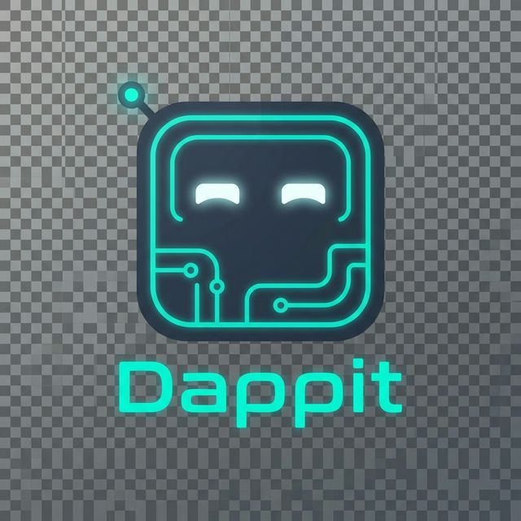

# 🤖 Dappit Mobile — Vibe Code from Your Phone

> **The first mobile Web3 vibe coding platform.** Describe an app → AI builds it → Preview it live → Ship it. All from your Android phone.

<p align="center">
  
</p>

---

## 🚀 What is Dappit Mobile?

Dappit Mobile brings the power of AI-assisted web development to your phone. Built on **Solana Mobile Stack**, it combines:

- **AI App Builder** — Describe any app in plain English. Dappit's AI (Claude) generates a complete HTML/CSS/JS app in ~5 seconds, rendered live in a WebView
- **Iterative Vibe Coding** — Don't like it? Type "make it darker" or "add a navbar" and watch it regenerate
- **Solana Wallet** — Full Mobile Wallet Adapter (MWA) integration with Phantom/Solflare
- **Token Launcher** — Create and launch tokens on Solana directly from your phone
- **AI Chat** — Conversational AI assistant for Web3 development questions

## ✨ Hero Feature: App Builder

```
You type:  "Build a crypto portfolio dashboard with live prices"
AI builds: Complete HTML/CSS/JS app with charts, gradients, dark mode
You see:   Live preview in WebView, running on your phone
You say:   "Add a sidebar with wallet balances"  
AI iterates: Updated app with your changes, instantly
```

The App Builder uses Dappit's cloud AI backend (`dappit.io/api/llmcall`) with Claude Haiku for fast generation (~5-10s), streamed via `XMLHttpRequest` for React Native compatibility.

## 🏗️ Architecture

```
┌─────────────────────────────────┐
│        Dappit Mobile App        │
│  (React Native + Expo SDK 52)   │
├─────────────┬───────────────────┤
│  AI Builder │  Solana Wallet    │
│  AI Chat    │  Token Launcher   │
│  Dashboard  │  Account Mgmt    │
├─────────────┴───────────────────┤
│        Service Layer            │
│  AIService (XHR → dappit.io)    │
│  TokenService (Supabase)        │
│  MobileWalletAdapter (MWA)      │
├─────────────────────────────────┤
│     Solana Mobile Stack         │
│  web3.js · MWA · spl-token     │
└─────────────────────────────────┘
```

## 📱 Screenshots

| Dashboard | App Builder | AI Chat |
|-----------|-------------|---------|
| SOL balance, points, hackathon status | Prompt → AI generates → Live preview | Web3 dev assistant powered by Claude |

| Wallet | Token Launcher | Saved Apps |
|--------|----------------|------------|
| Phantom/Solflare via MWA | Create tokens on Solana | Save & manage generated apps |

## 🛠 Tech Stack

| Technology | Purpose |
|---|---|
| **React Native** (0.76) + **Expo** (SDK 52) | Cross-platform mobile framework |
| **Solana web3.js** | Blockchain transactions & RPC |
| **Mobile Wallet Adapter** (MWA v2) | Phantom/Solflare wallet integration |
| **React Native Paper** (Material Design 3) | Premium UI components |
| **React Native SVG** | Brand icon rendering |
| **WebView** | Live HTML/CSS/JS preview |
| **react-native-svg** | Custom brand SVG icons |
| **AsyncStorage** | Local project persistence |
| **Dappit Cloud API** | AI code generation (Claude Haiku) |
| **TypeScript** | Type-safe development |

## 🔧 Custom Components

- **`DappitIcon`** — Brand icon system with SVG robot mascot, hex logo, 3D brand PNGs, and MaterialCommunityIcons
- **`AIService`** — XMLHttpRequest-based API client (not `fetch()`) for Cloudflare compatibility on React Native Android
- **`BuilderScreen`** — Full vibe coding flow: prompt → presets → generate → preview → iterate → save
- **`useMobileWallet`** — MWA hook for connect, sign, and send transactions

## 🚀 Quick Start

### Prerequisites
- Node.js 18+
- Android device with USB debugging enabled
- JDK 17 + Android SDK 34
- Phantom or Solflare wallet app installed on device

### Development

```bash
# Clone
git clone https://github.com/Achilles1089/dappit-mobile.git
cd dappit-mobile

# Install dependencies
npm install

# Generate native project
npx expo prebuild --platform android

# Build and install on device
npx expo run:android --device

# Start Metro dev server
npx expo start --dev-client
```

### Key Files

```
src/
├── screens/
│   ├── BuilderScreen.tsx      # AI App Builder (hero feature)
│   ├── AIChatScreen.tsx       # AI Chat assistant
│   ├── DashboardScreen.tsx    # Home dashboard
│   ├── WalletScreen.tsx       # Solana wallet (MWA)
│   ├── TokenLauncherScreen.tsx # Token creation
│   └── LoginScreen.tsx        # Auth flow
├── components/
│   └── DappitIcon.tsx         # Brand icon system
├── services/
│   ├── ai.ts                  # AI API client (XHR)
│   ├── api.ts                 # Axios config
│   └── token.ts               # Token/points service
├── theme/
│   └── colors.ts              # Brand color system
└── utils/
    ├── useMobileWallet.tsx    # MWA hook
    └── useAuthorization.tsx   # Auth state
```

## 🎯 Hackathon Notes

### Challenges Solved
1. **React Native + Cloudflare** — `fetch()` (OkHttp) fails against Cloudflare. Solved with `XMLHttpRequest`
2. **Model Registry** — Mobile client needed exact model names from deployed API registry
3. **Streaming vs Timeout** — Haiku fast enough (~5s) to avoid Cloudflare's 60s gateway timeout
4. **SVG in React Native** — Custom brand icons via `react-native-svg` instead of emoji characters

### What Makes This Special
- **First mobile vibe coding platform** — no laptop needed, build apps from your phone
- **Native Solana integration** — not a web wrapper, real MWA wallet signing
- **Production AI backend** — powered by Dappit's live cloud infrastructure at `dappit.io`

---

<p align="center">
  Built with 🔥 by <a href="https://dappit.io">Dappit</a> — The First Web3 Vibe Coding Platform
</p>
